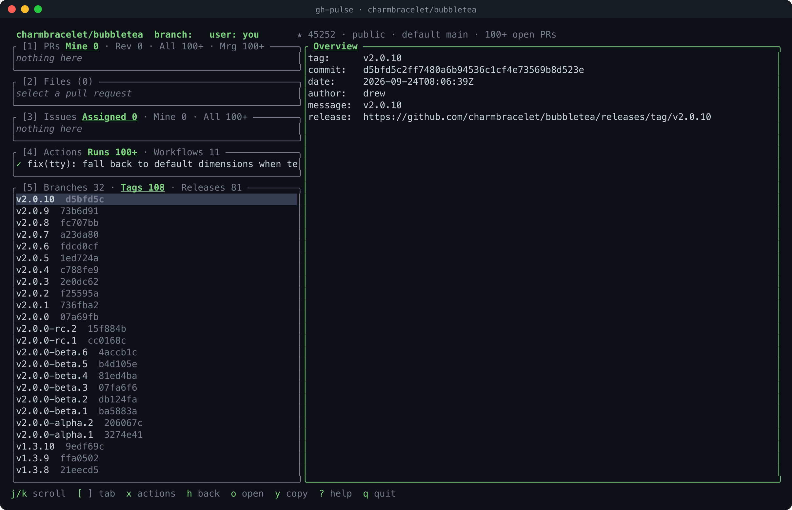

# gh-pulse

**lazygit for GitHub: a keyboard-driven TUI over the `gh` CLI.**

Numbered panels on the left, a detail pane on the right. Review pull requests (diffs, checks, review threads),
triage issues, watch workflow runs, browse branches and releases, and act on all of it without leaving the
terminal. It shells out to [`gh`](https://cli.github.com), so there is no token handling: whatever `gh` can
see, gh-pulse can see.


<sub>Real session against a public repository (login shown as `you`).</sub>

## Screenshots

Captured from the real binary against public repos (`scripts/screenshots.py`).


*Zoomed Diff tab (`f`): auto layout picks side-by-side at width, with syntax highlighting and intra-line highlights.*


*Unified layout with soft wrap (`t` / `w`) keeps long prose lines readable.*


*Enter on a PR drills into Files / Commits / Checks / Comments; markers show files with review comments.*


*Comment cards with markdown, role badges and review summaries; bot boilerplate is collapsed.*


*[4] Actions: workflow runs with their jobs and steps.*


*[5] Repo: Branches / Tags / Releases tabs; a tag shows its commit, date and release.*


*Every action is confirmed first and shows the exact `gh` command it will run (only `y` runs it; this one was cancelled).*


*`?` lists every key.*


*At 80x24 the panels shrink to short titles and the key hints truncate.*

Regenerate with `GH_PULSE_SHOT_BLOCKLIST=word,word python3 scripts/screenshots.py` (needs `pyte` and `rsvg-convert`; public repos only; the blocklist aborts a shot if a private string shows).

## Features

- **Five repo-scoped panels**: Pull requests (Mine / Review / All / Merged), Files, Issues (Assigned / Mine / All),
  Actions (Runs / Workflows) and Repo (Branches / Tags / Releases). Every title shows the count of every tab
  (`[5] Branches 32 · Tags 14 · Releases 81`, `…` until known). Filter any list with `/`. Choose, order and trim the
  panels and their tabs under `[panels]` ([configuration](docs/configuration.md)).
- **Inbox**: `✉ N` in the header counts your unread notifications; `N` opens them across all repos. `Enter` shows the
  PR or issue in the app (switching repo), `m` marks it read (after the usual exact-command confirm), `o` opens it in the browser.
- **Code review without the browser**: unified, split or auto diff with soft-wrap, word-level highlighting,
  syntax highlighting (on by default), per-file stats, review-thread badges and viewed marks.
- **Comments as cards**: GitHub-flavored markdown rendered in the terminal (headings, emphasis, inline and fenced
  code with syntax highlighting, quotes, lists, task lists, tables, links), author role badges, relative
  times, edited markers, reaction counts (`e` for names), nested review-thread replies with resolved/outdated
  badges. Bot boilerplate (`<details>`, HTML comments, huge blobs) is collapsed; `Enter` expands. Long threads page in
  gently: the first page at once, up to 500 more automatically, the rest as you scroll or press `m` (with a clear
  "GitHub rate limit, retry in Ns" message if GitHub throttles).
- **PR drill-in**: `Enter` on a PR turns the left column into that PR's Files, Commits, Checks and Comments. The
  right pane shows the diff of the selected file or commit, a check's log, or a full thread.
- **Actions with a seatbelt**: approve, request changes, comment, merge, close, label, assign, reply to or
  resolve threads, comment on a diff line, re-run or cancel runs, create issues/releases, delete branches. Every
  one shows the exact command first.
- **Global view**: your PRs and issues across all repositories (`G`), plus a full-screen **repo browser** (`B`) over every repo you can access, with search, sort, favorites and hide.
- **Mouse and keyboard**: click panels, rows and tabs; wheel scrolls. `?` shows every key.
- **Themes**: dark and light palettes, truecolor with a 256-color fallback, ASCII and Nerd Font icon sets.
- **Create from the terminal**: new issue (labels validated, `.md` templates, body in a multi-line field), new PR
  (base picker, draft, reviewers, `--fill`, PR template, warns if the branch isn't pushed), and run a workflow with
  a form generated from its `workflow_dispatch` inputs (read from the default branch; branches and tags offered as the ref). Each ends in the exact-command confirm popup.
- **Viewed files**: remembered locally per PR head; optionally mirrored to GitHub (`sync_viewed`).
- **Command log**: `L` shows every `gh`/`git` command that was run.

## Requirements

- [`gh`](https://cli.github.com) installed and authenticated (`gh auth login`).
- Rust 1.89 or newer to build (edition 2024 with let-chains; 1.89 is the oldest toolchain it is tested on).
- A terminal of at least 50x12 (80x24 or larger recommended). UTF-8 and truecolor are optional.

## Installation

```sh
# from GitHub
cargo install --git https://github.com/navbytes/gh-pulse

# from a clone
git clone https://github.com/navbytes/gh-pulse && cd gh-pulse
cargo install --path .

# smaller plain build without syntax highlighting
cargo install --path . --no-default-features
```

Syntax highlighting (the `syntax` cargo feature, built on the pure-Rust `syntect`) is on by default. It adds about
2.8 MB: the release binary is about 5.4 MB with it and about 2.6 MB with `--no-default-features`, and a clean
build takes a few seconds longer. Diffs fall back to plain +/- coloring in the small build. Highlighting is
incremental and cached per file; jumping to the end of a huge diff skips the lines in between (they stay plain).
(To opt out when installing from GitHub: `cargo install --git https://github.com/navbytes/gh-pulse --no-default-features`.)

## Usage

Run it inside a clone of a GitHub repository, or point it at one:

```sh
gh-pulse                       # repo of the current directory
gh-pulse -R cli/cli            # any repo you can access
gh-pulse --theme light --ascii
gh-pulse                       # then press B to browse every repo you can access
```

| Flag | Meaning |
|---|---|
| `-R, --repo owner/repo` | Repo to show. Checked up front; exits with a clear message if it is not found. |
| `--theme dark\|light` | Color palette (default `dark`). |
| `--ascii` | ASCII icons and borders. Also automatic when the locale is not UTF-8. |
| `--nerd` | Nerd Font icons. |
| `--clear-cache` | Delete gh-pulse's on-disk cache (`~/.cache/gh-pulse`) and exit. |

gh-pulse needs an interactive terminal; piping stdin/stdout prints a message and exits.

## Configuration

Optional `~/.config/gh-pulse/config.toml` (`$XDG_CONFIG_HOME` is honored): default theme and icons, favorite and
hidden repos (written by the repo browser), and key remapping. Flags override the file; a missing file means
defaults; an invalid file stops startup with `file:line: message`. See [docs/configuration.md](docs/configuration.md).
The file never contains credentials; authentication stays entirely with `gh`.

## Local state

Slow-changing lookups are cached under `$XDG_CACHE_HOME/gh-pulse` (default `~/.cache/gh-pulse`; a `0700` directory
you own, files `0600`; a relative `XDG_CACHE_HOME` is ignored, and if the directory is not yours or is a symlink the
cache switches itself off with a notice). What is stored:

- **Repo list** (10 min) and **repo header facts** (5 min): repo names, descriptions, topics, counts; keyed by host and
  login, so another account or host never sees them. Cached rows are cleaned again when read.
- **Raw file text from repos: issue/PR templates and workflow YAML (1 h), labels (1 h) and tags (10 min).** These come
  from the repo you opened, private ones included, so their contents sit on your disk for up to an hour. They are
  gh's own cache entries (`gh api --cache`, keyed on host, token and request), kept inside gh-pulse's directory.

Never cached: tokens, comments, notifications, PR details, diffs, anything from a write. `gh-pulse --clear-cache`
deletes the whole directory; `[api] cache = false` turns caching off; `r` and `R` skip it.

Files you mark viewed (`v`) are remembered in `$XDG_STATE_HOME/gh-pulse/viewed.json` (default
`~/.local/state/`), per repo and PR, and reset when the PR's head commit changes. Nothing is written to GitHub.
A corrupt state file is ignored with a warning, never a crash.

## Concepts

- **Repo scope.** Everything is about one repository: the current directory's, or `-R`. The header shows the
  repo, your local branch (only when the directory is a clone of it), your user, and the repo's stars, visibility, default branch and open-PR count. `B` (or `Ctrl-r`) opens the repo browser to switch.
- **Panels.** Numbered like lazygit; the focused one expands, the rest collapse. `[` `]` change the detail
  tab, `{` `}` change the panel's own list (e.g. Mine vs Merged); pressing the focused panel's number again also steps to
  its next list tab, and the tab labels in the title are clickable.
- **Files follows the PR.** Panel 2 lists the files of the selected PR; moving through it changes the
  file shown in the diff.
- **Drill-in.** `Enter` on a PR replaces the left column with Files / Commits / Checks / Comments of that PR; `Esc` goes
  back and your cursor is where you left it.
- **Global view.** `G` (list focus) swaps the PR and Issues panels to searches across all your repos.
- **Safety.** See below.

## Keybindings

The full reference is in [docs/keybindings.md](docs/keybindings.md). The essentials:

| Context | Key | Action |
|---|---|---|
| Global | `?` / `q` | Help / quit |
| Global | `1`-`5`, `Tab`, `Shift-Tab` | Focus panel |
| Global | `x` | Action menu for the selected item |
| Global | `o` `y` `c` | Open in browser / copy URL / check out PR |
| Global | `r` `R` `L` | Refresh selected item / reload everything / command log |
| Lists | `j` `k` `Ctrl-d` `Ctrl-u` `g` `G` | Move |
| Lists | `/` `Esc` | Filter / clear |
| Lists | `{` `}` | Panel list tab |
| Lists | `Enter` | Drill into a PR, else focus detail |
| Detail | `[` `]` | Detail tab |
| Detail | `h` `Esc` | Back to the list |
| Diff | `n` `p` | Next / previous file |
| Diff | `t` `w` `v` `f` | Layout / wrap / viewed / zoom |
| Actions | `a` `C` `m` | Approve / comment / merge |
| Popups | `y` / `n` | Confirm / cancel |
| Popups | `Ctrl-S` | Submit text input |

## Safety model

gh-pulse never writes without asking.

1. Every mutation opens a **confirm popup that shows the exact command line** (`gh pr merge 12 -R owner/repo --squash`).
2. Only **`y`** runs it. `Enter` does not, so a double-tapped menu key can't fire it; `n` or `Esc` cancels.
3. Text input (comments, labels, titles) uses a multi-line popup, `Ctrl-S` to continue, and then the same
   confirm step.
4. The **command log** (`L`) lists every `gh`/`git` command that ran, reads included, and errors.
5. Local actions (check out a PR, `git switch`) only run when the current directory is a clone of that repo.
6. User text is passed as separate arguments, never through a shell.

## Theming and icons

`--theme light|dark` picks the palette. Truecolor is used when `COLORTERM` is `truecolor`/`24bit`, otherwise the
nearest of 256 colors. Icons are Unicode by default, `--ascii` for plain ASCII (borders too), `--nerd` for Nerd
Font glyphs.

## Diff view

`t` cycles auto / unified / split (auto goes side-by-side when each half has 60+ columns). Long lines soft-wrap
at word boundaries with a `↪` marker; `w` switches to clipping. `f` zooms the right pane to full width.

## FAQ and troubleshooting

- **"not in a GitHub repo" / "repo not found or no access".** Run inside a clone or pass `-R owner/repo`;
  check `gh auth status` and that the account can see the repo.
- **Panels sit on "loading...".** gh-pulse waits on `gh`; slow networks or a large account mean several
  seconds. `L` shows what is running.
- **"Terminal too small".** The minimum is 50x12. On short terminals unfocused panels collapse to one line.
- **Colors look washed out or odd.** Your terminal probably lacks truecolor: set `COLORTERM=truecolor` if it
  supports it, or try `--theme light` on light backgrounds.
- **A `⚡ 412/5000` chip appears in the header / "paused background refresh".** GitHub's API quota is running
  low (under 20%, configurable). Below 10% gh-pulse stops everything it does by itself (tab counts, extra comment
  pages, the inbox badge) until the window resets, shown as `resets HH:MM`; what you ask for still works. At
  `Retry-After` / secondary-limit messages it backs off for the time given.
- **How much API does it use?** One GraphQL request fills the first screen (PRs, issues, repo facts), other panels
  load when first focused, at most 4 `gh` processes run at once, and the only polling is the unread badge (2 min)
  and a free `gh api rate_limit` check (5 min). Tab counts of search-backed tabs show `?` until opened. See
  [docs/configuration.md](docs/configuration.md#api-etiquette).
- **Boxes and icons are garbled.** Use `--ascii`, or install a Nerd Font and use `--nerd`.
- **A huge PR shows its diff anyway.** Over 300 files `gh pr diff` refuses; gh-pulse falls back to the files API.

## Roadmap

- Sync viewed marks with GitHub's own viewed state (a mutation, so it would go through the confirm popup).
- Open PR/issue counts in more places; org-level views.

See [docs/BACKLOG.md](docs/BACKLOG.md).

## Contributing

See [CONTRIBUTING.md](CONTRIBUTING.md) and [docs/architecture.md](docs/architecture.md).

## License

MIT, see [LICENSE](LICENSE).
